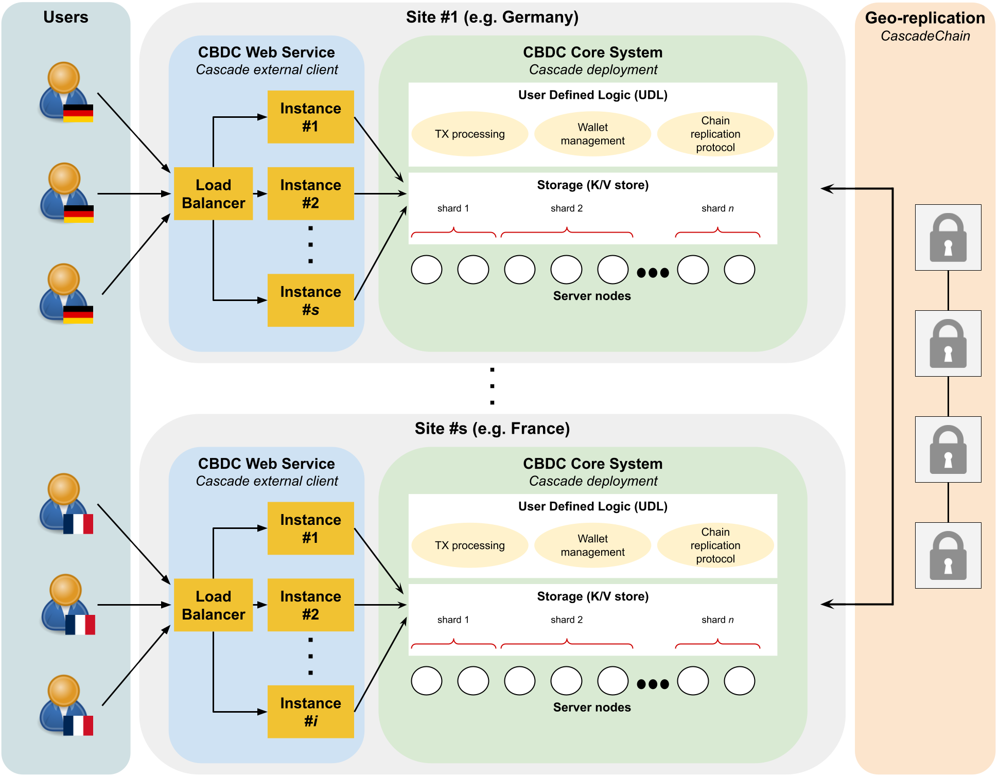

# CascadeCBDC
CascadeCBDC is a Central Bank Digital Coin (CBDC) built on top of Cascade. It
makes use of the fast K/V store and the User Defined Logic (UDL) framework
provided by Cascade. Replication and sharding features are inherited from
Cascade (and the Derecho library underneath), while CascadeCBDC implements a
protocol based on chain replication to ensure the consistency of multi-shard
transactions. Furthermore, CascadeCBDC leverages CascadeChain for WAN
replication and auditability. CascadeChain creates a tamper-proof auditable log,
structured as cryptographically linked batches of transactions, which is
replicated across geographically distributed sites. Innovations include our
security model, which matches well with CBDC real-world requirements, and a
series of architectural design choices that move most operations off the
critical path in order to ensure high throughput and low latency.

Table of contents:

- [Overview](#overview)
    - [Current implementation](#current-implementation)
    - [Future work](#future-work)
- [Requirements](#requirements)
- [Setup](#setup)
    - [Compilation](#compilation)
    - [Starting the service](#starting-the-service)
- [Benchmark tools](#benchmark-tools)
    - [Generating benchmark workload](#generating-benchmark-workload)
    - [Running a benchmark](#running-a-benchmark)
    - [Metrics](#metrics)
- [Configuration options](#configuration-options)
    - [Cascade configuration](#cascade-configuration)
    - [CascadeCBDC client configuration](#cascadecbdc-client-configuration)
    - [CascadeCBDC core configuration](#cascadecbdc-client-configuration)

## Overview
The diagram below shows the high-level architecture of CascadeCBDC.


CascadeCBDC is composed of multiple sites, which could be, for example, different countries participating in the same global CBDC system. Each site is responsible for maintaining a Cascade deployment (the core transaction processing system) and a user-facing web service in its own datacenter. All transactions are replicated across all sites by CascadeChain, providing a tamper-proof, digitally signed log that is also highly available. Users are directed to specific sites: in the example above, users sent requests to the country where their wallets were registered at.

At each site, a web service receives requests from users. The web service is responsible for authenticating the user, i.e. verifying if the user has the right to perform the requested operation. Operations are packaged by the web service as transaction and sent to the core system to be processed. The core system is implemented as a User Defined Logic (UDL) on top of the Cascade K/V store. The Cascade repo provides more details about the UDL framework, but essentially a UDL can be thought as a stored procedure that is triggered when certain objects in the K/V store are modified.

The following requests can be made by a user:
- Transfer funds from a set of wallets to another set of wallets
- Withdrawn coins to be used outside CascadeCBDC
- Redeem CBDC-issued coins, depositing them back into a set of wallets

### Current implementation
A simplified version of the core system is implemented, in addition to a benchmark tool which plays the role of the web service in the diagram above. We are currently focusing on improving the TX processing performance and scalability. Geo-replication, user authentication, wallet management, and external coins issuance/redemption are thus not implemented yet.

### Future work
CascadeCBDC is in active research and development. There's no de facto standard or regulation to what a CBDC is and what are the requirements. It's important then to keep our design flexible. There's still a lot of research to be done, but currently this is a short list of what's to come to CascadeCBDC:
- Integration with CascadeChain for geo-replication and auditability.
- API for issuing and redeeming external coins (e.g. for use in P2P transactions in blockchain platforms, through bridges or other protocols)
- User-facing web service with wallet authentication and management

## Requirements

The easiest way to try out this project is to use our docker image with all the requirements pre-installed:
```
$ sudo docker run -d --hostname cascade-cbdc --name cascade-cbdc -it tgarr/cascade-cbdc:latest
$ sudo docker exec -w /root -it cascade-cbdc /bin/bash -l
```

We assume the use of the docker image in the examples and instructions provided in this document. In case you do not wish to use it, the following is required to compile and run CascadeCBDC:

- Cascade (https://github.com/Derecho-Project/cascade), branch `single_shard_multiobject_put` (the master branch won't work)
- gzstream and zlib (in Ubuntu: `sudo apt install libgzstream-dev zlib1g-dev`)

## Setup
This section will give instructions on how to compile and run CascadeCBDC in a basic deployment, with two Cascade servers and one client, all in the same host (in this case, a docker container running our image). In order to increase the number of servers/clients, or to run processes in multiples network nodes, see [Configuration options](#configuration-options).

### Compilation
```
root@cascade-cbdc:~# git clone https://github.com/Derecho-Project/cascade-cbdc.git
root@cascade-cbdc:~# mkdir cascade-cbdc/build && cd cascade-cbdc/build
root@cascade-cbdc:~/cascade-cbdc/build# cmake .. && make -j
```
This will create the following in the `build` directory (we omit below other files that are not relevant):

- `cfg`: folder containing the configuration files necessary to run Cascade server processes and a CascadeCBDC client
    - `dfgs.json`: UDL configuration, containing all UDLs to be loaded by Cascade, how each one is triggered, and custom configuration options for each UDL. In CascadeCBDC, there is only one UDL that implements the CascadeCBDC core, with several options for performance tuning. This file must be the same for all server processes.
    - `layout.json`: this configures the layout of the deployment, i.e. how many shards and processes per shard, as well as the exact shard membership. This file must be the same for all server and client processes.
    - `udl_dlls.cfg`: this lists the shared libraries (containing UDLs) that should be loaded by the Cascade servers. This file must be the same for all server processes.
    - `n0`: folder containing configuration files to run a Cascade server with ID 0
        - `derecho.cfg`: Cascade and Derecho configuration file, setting the process ID and network configuration (addresses,ports,protocols).
        - `dfgs.json`,`layout.json`,`udl_dlls.cfg`: links to the corresponding files in the parent folder.
    - `n1`: folder containing configuration files to run Cascade server with ID 1
        - `derecho.cfg`: Cascade and Derecho configuration file, setting the process ID and network configuration (addresses,ports,protocols).
        - `dfgs.json`,`layout.json`,`udl_dlls.cfg`: links to the corresponding files in the parent folder.
    - `client`: folder containing configuration files to run a CascadeCBDC client
        - `derecho.cfg`: Cascade and Derecho configuration file, setting the process ID and network configuration (addresses,ports,protocols).
        - `dfgs.json`,`layout.json`,`udl_dlls.cfg`: links to the corresponding files in the parent folder.
        - `generate_workload`,`run_benchmark`,`metrics.py`: links to the executable in the `build` folder, for convenience.
- `libcbdc_udl.so`: this shared library is loaded by all Cascade servers. It contains the UDL that implements the CascadeCBDC core.
- `generate_workload`: this executable generates a workload used as input to `run_benchmark` (more details in [Benchmark tools](#benchmark-tools))
- `run_benchmark`: this executable runs a benchmark using a given workload file (more details in [Benchmark tools](#benchmark-tools))
- `metrics.py`: this script takes benchmark log outputs (from client and servers) and computes some simple metrics, such as throughput and latency breakdown (more details in [Benchmark tools](#benchmark-tools)).
- `setup_config.sh`: this script generates, in the `cfg` folder, the necessary configuration files for a given number of shards and processes per shard. More details in [Configuration options](#configuration-options).

### Starting the service
To start the service, it's necessary to run two instances of `cascade_server`: one in the `cfg/n0` folder and another in the `cfg/n1` folder. The first process is the Cascade metadata service, and the second constitutes the single shard (with a single process) of the CascadeCBDC service. Example:
<table>
<tr>
<th>@~/cascade-cbdc/build/cfg/n0</th>
<th>@~/cascade-cbdc/build/cfg/n1</th>
</tr>
<tr>
<td>

```
$ cascade_server 
Press Enter to Shutdown.

```

</td>
<td>

```
$ cascade_server 
Press Enter to Shutdown.

```

</td>
</tr>
</table>

Cascade provides a simple command-line tool for interacting with the K/V store. Let's try it out by running `cascade_client.py` in the `cfg/client` folder. This client provides a shell-like interface. The `help` command lists all available options. Example:
<table>
<tr>
<th>@~/cascade-cbdc/build/cfg/client</th>
</tr>
<tr>
<td>

```
$ cascade_client.py
(cascade.client) list_members
Nodes in Cascade service:[0, 1]
(cascade.client) create_object_pool /test PersistentCascadeStoreWithStringKey 0
[3, 1726478940683116]
(cascade.client) put /test/example hello_world
[1, 1726478948893719]
(cascade.client) list_keys_in_object_pool /test
[
 ['/test/example']
]
(cascade.client) get /test/example
{'key': '/test/example', 'value': b'hello_world', 'version': 1, 'timestamp': 1726478948893719,
'previous_version': 0, 'previous_version_by_key': 0, 'message_id': 0}
(cascade.client) quit
Quitting Cascade Client Shell
```

</td>
</tr>
</table>

Your are ready now to run CascadeCBDC! See below how to use the benchmark tools.

## Benchmark tools
Three tools are currently provided, in the form of three executables: `generate_workload`, `run_benchmark`, and `metrics.py`. These tools only evaluate transaction processing in a local deployment. WAN replication is not implemented yet.

A workload file should first be generated using `generate_workload`. A workload consists of a set of transfers to be performed between wallets. `run_benchmark` executes a given workload and generate log files containing several timestamps. The `metrics.py` script computes metrics based on the generated log files. More details on each tool below.

### Generating benchmark workload
The `generate_workload` executable generates a workload that can be used to run a benchmark. The workload is saved in a zipped file.
```
root@cascade-cbdc:~/cascade-cbdc/build/cfg/client# ./generate_workload -h
usage: ./generate_workload [options]
options:
 -w <num_wallets>		number of wallets to create
 -n <wallet_start_id>		wallets initial id
 -t <transfers_per_wallet>	how many times each wallet appears across all transfers
 -s <senders_per_transfer>	number of wallets sending coins in each transfer
 -r <receivers_per_transfer>	number of wallets receiving coins in each transfer
 -i <wallet_initial_balance>	initial balance of each wallet
 -v <transfer_value>		amount transfered from each sender
 -g <random_seed>		seed for the RNG
 -o <output_file>		file to write the generated workload (zipped)
 -h				show this help
```

The default name of the output file is a concatenation of all parameters, with the extension `.gz`. The generated file can be seen using `zcat`. For example:
```
root@cascade-cbdc:~/cascade-cbdc/build/cfg/client# ./generate_workload -w 4
parameters:
 num_wallets = 4
 wallet_start_id = 0
 transfers_per_wallet = 1
 senders_per_transfer = 1
 receivers_per_transfer = 1
 wallet_initial_balance = 100000
 transfer_value = 10
 random_seed = 3
 output_file = 4_0_1_1_1_100000_10_3.gz

generating ...
writing to '4_0_1_1_1_100000_10_3.gz' ...
done
root@cascade-cbdc:~/cascade-cbdc/build/cfg/client# zcat 4_0_1_1_1_100000_10_3.gz 
4 0 1 1 1 100000 10 3 2 4 2
0 100000
1 100000
2 100000
3 100000
3 10 1 10 
0 10 2 10 
0 99990
1 100010
2 100010
3 99990
0 1
1 1
```

The generated file can be loaded using the static method `CBDCBenchmarkWorkload::from_file(filename)`. The workload provides three structures that can be used to execute a benchmark:
- Wallets/coins to be minted: obtained by calling `get_wallets()`
    - This is a map from wallet\_id\_t to a wallet\_t, which currently is just a value (the wallet balance, coin\_value\_t). 
- Transfers: obtained by calling `get_transfers()`
    - This is a vector of transfer structures. Each transfer contains a vector of senders and a vector of receivers. Each sender/receiver is a map (wallet\_id\_t to coin\_value\_t).
- Expected balances: obtained by calling `get_expected_balance()`
    - This is a map between a pair wallet\_id\_t and coin\_value\_t, corresponding to the expected balance of each wallet. This should be used to verify the correctness of the benchmark.
- Expected status: obtained by calling `get_expected_status()`
    - This is a map between the transfer index (following the order returned by `get_transfers()`) and whether the corresponding transfer should be successful or not. This is relevant in case of conflicting transfers.

### Running a benchmark
The `run_benchmark` executable runs a benchmark using a given workload file (pre-generated with `generate_workload`). It uses the CascadeCBDC class, which starts a Cascade external client, thus there must be a `derecho.cfg` configuring it.
```
root@cascade-cbdc:~/cascade-cbdc/build/cfg/client# ./run_benchmark -h
usage: ./run_benchmark [options] <benchmark_workload_file>
options:
 -o <output_file>	file to write the local measurements log
 -l <remote_log>	file to write the remote measurements logs
 -r <send_rate>	rate (in transfers/second) at which to send transfers (default: unlimited)
 -w <wait_time>	time to wait (in seconds) after each step (default: 5)
 -b <batch_min_size>	minimum batch size (default: 0)
 -x <batch_max_size>	maximum batch size (default: 150)
 -u <batch_time_us>	maximum time to wait for the batch minimum size, in microseconds (default: 500)
 -a			do not reset the service (Note: this can lead to incorrect final balances if re-executing the same benchmark)
 -m			skip minting step
 -s			skip transfer step
 -c			skip check step
 -h			show this help
```

See below an example of execution in our container. In this example, `run_benchmark` needs to be called in the `cfg/client` folder, since `run_benchmark` connects to Cascade as an external client (thus requires the configuration files in the folder). The Cascade servers need to be started in the same way as described [above](#starting-the-service). The example below uses a workload with 20000 wallets and 10000 transfers between those wallets, generated with the command `./generate_workload -w 20000`.
```
root@cascade-cbdc:~/cascade-cbdc/build/cfg/client# ./run_benchmark 20000_0_1_1_1_100000_10_3.gz
setting up ...
  workload_file = 20000_0_1_1_1_100000_10_3.gz
  send_rate = 0
  wait_time = 5
  batch_min_size = 0
  batch_max_size = 150
  batch_time_us = 500
  output_file = 20000_0_1_1_1_100000_10_3.gz.log
  remote_log = cbdc.log
resetting the CBDC service ...
minting wallets ...
waiting last mint to finish ...
performing 10000 transfers ...
waiting last TX to finish ...
checking 20000 final balances ...
  0 balance errors found
checking 10000 final status ...
  0 status errors found
writing log to '20000_0_1_1_1_100000_10_3.gz.log' ...
done
```

This will generate a set of logs: one at the client and one in each server process (except for process ID 0). By default, the name of the log file at the servers is `cbdc.log`, while at the client the default is the name of the workload file + `.log`.

### Metrics
The script `metrics.py` takes benchmark log outputs (from client and servers) and computes some simple metrics, such as throughput and end-to-end latency. The log output from servers must be downloaded (they are saved by each server in a file named according to the `-l` option of `run_benchmark` (default `cbdc.log`).
```
root@cascade-cbdc:~/cascade-cbdc/build/cfg/client# ./metrics.py -h
usage: metrics [-h] [-b] [-l] files [files ...]

Compute metrics from Cascade timestamp log files. Always compute throughput, other metrics are optional.

positional arguments:
  files           Cascade timestamp log files

options:
  -h, --help      show this help message and exit
  -b, --batching  compute batching statistics
  -l, --latency   compute latency breakdown
```

The script computes metrics assuming all hosts have their clocks synchronized with PTP (naturally, this assumption will change when we start evaluating the WAN replication). In our example, all processes are running in the same host, thus all use the same clock. Furthermore, the script discards measurements for the first 5%, and the last 5% transactions (thus only 9000 TXs are considered for the example benchmark above). See below the metrics for the benchmark executed in our example:
```
root@cascade-cbdc:~/cascade-cbdc/build/cfg/client# ./metrics.py 20000_0_1_1_1_100000_10_3.gz.log ../n1/cbdc.log 
client sending rate: 119414.58 tx/s (9000 TXs in 0.08 seconds)
real sending rate: 75296.04 tx/s (9000 TXs in 0.12 seconds)
throughput: 52801.43 tx/s (9000 TXs in 0.17 seconds)
e2e latency: avg 45.033 | std 14.301 | med 46.885 | min  9.733 | max 76.055 | p95 65.979 | p99 72.960
```

## Configuration options

### Cascade configuration

We provide below some tips on how to configure the Cascade deployment on which CascadeCBDC is running. For more details, please refer to the [Cascade repo](https://github.com/Derecho-Project/cascade).

#### Increasing servers and clients
To have more clients, shards, and/or processes per shard, it is necessary to generate a new `layout.json` file, as well as a new `derecho.cfg` for each process. The script `setup_config.sh` can do that: the first parameter is the number of shards, while the second parameter is the number of processes per shard. In the example below, configuration files for 2 shards with 2 processes in each are generated, and the resulting folder tree is also shown:
```
root@cascade-cbdc:~/cascade-cbdc/build# ./setup_config.sh 2 2
root@cascade-cbdc:~/cascade-cbdc/build# tree cfg/
cfg/
|-- client
|   |-- derecho.cfg
|   |-- dfgs.json -> ../dfgs.json
|   |-- generate_workload -> ../../generate_workload
|   |-- layout.json -> ../layout.json
|   |-- metrics.py -> ../../metrics.py
|   |-- run_benchmark -> ../../run_benchmark
|   `-- udl_dlls.cfg -> ../udl_dlls.cfg
|-- derecho.cfg
|-- derecho.cfg.tmp
|-- dfgs.json
|-- dfgs.json.tmp
|-- layout.json
|-- layout.json.tmp
|-- n0
|   |-- derecho.cfg
|   |-- dfgs.json -> ../dfgs.json
|   |-- layout.json -> ../layout.json
|   `-- udl_dlls.cfg -> ../udl_dlls.cfg
|-- n1
|   |-- derecho.cfg
|   |-- dfgs.json -> ../dfgs.json
|   |-- layout.json -> ../layout.json
|   `-- udl_dlls.cfg -> ../udl_dlls.cfg
|-- n2
|   |-- derecho.cfg
|   |-- dfgs.json -> ../dfgs.json
|   |-- layout.json -> ../layout.json
|   `-- udl_dlls.cfg -> ../udl_dlls.cfg
|-- n3
|   |-- derecho.cfg
|   |-- dfgs.json -> ../dfgs.json
|   |-- layout.json -> ../layout.json
|   `-- udl_dlls.cfg -> ../udl_dlls.cfg
|-- n4
|   |-- derecho.cfg
|   |-- dfgs.json -> ../dfgs.json
|   |-- layout.json -> ../layout.json
|   `-- udl_dlls.cfg -> ../udl_dlls.cfg
|-- udl_dlls.cfg
`-- udl_dlls.cfg.tmp
```

For starting the service in this case, it is necessary to run `cascade_server` in each of the folders from `n0` to `n4`.

#### Multiple nodes in a network
In case you want to deploy Cascade servers and clients on separate nodes in a network, it is necessary to change `derecho.cfg` with the appropriate network configuration for all processes. Three configurations in the file must be changed:
- `contact_ip`: this must be set to the IP address of the process with ID 0 (the one using the config files in the `n0` folder).
- `local_ip`: this must be set to the local IP address of the process. Other processes will use this address to communicate with this process.
- `domain`: this must be set to network interface to be used (taken from `ifconfig`), e.g. `eth0`.

When copying configuration files from one host to another, it is important to note that two processes cannot have the same ID, which is set by `local_id`  in `derecho.cfg`. Also, when more than one process are in the same host, note that those processes cannot have the same ports assigned to them (see the multiple `*_port` configurations in `derecho.cfg`).

#### Using RDMA
In case you want to use RDMA instead of TCP, it is necessary to change the following two items in `derecho.cfg` for all processes:
- `provider` must be set to `verbs`.
- `domain` must be set to the device name (taken from `ibv_devices`), e.g. `mlx5_1`.

### CascadeCBDC client configuration
The `run_benchmark` executable provides many tuning options. The "send rate" (`-r`) option is the most important to note: it sets at which rate the client sends TXs to the CascadeCBDC core. The rate is set in TX per second. A rate of 0 means the client will send TXs as fast as possible. The example below sets the transfer rate to 10000 TX/s, which can be verified by the measurements reported by the `metrics.py` script ("real sending rate" and "throughput").
```
root@cascade-cbdc:~/cascade-cbdc/build/cfg/client# ./run_benchmark -r 10000 20000_0_1_1_1_100000_10_3.gz 
setting up ...
  workload_file = 20000_0_1_1_1_100000_10_3.gz
  send_rate = 10000
  wait_time = 5
  batch_min_size = 0
  batch_max_size = 150
  batch_time_us = 500
  output_file = 20000_0_1_1_1_100000_10_3.gz.log
  remote_log = cbdc.log
resetting the CBDC service ...
minting wallets ...
waiting last mint to finish ...
performing 10000 transfers ...
waiting last TX to finish ...
checking 20000 final balances ...
  0 balance errors found
checking 10000 final status ...
  0 status errors found
writing log to '20000_0_1_1_1_100000_10_3.gz.log' ...
done
root@cascade-cbdc:~/cascade-cbdc/build/cfg/client# ./metrics.py 20000_0_1_1_1_100000_10_3.gz.log ../n1/cbdc.log 
client sending rate: 9984.61 tx/s (9000 TXs in 0.90 seconds)
real sending rate: 9980.25 tx/s (9000 TXs in 0.90 seconds)
throughput: 9971.31 tx/s (9000 TXs in 0.90 seconds)
e2e latency: avg  1.060 | std  0.247 | med  1.029 | min  0.448 | max  3.531 | p95  1.421 | p99  1.931
```

### CascadeCBDC core configuration
The CascadeCBDC core can be configured in the `dfgs.json` file. There are many tuning parameters, but the most important one to note here is `num_threads`. This sets the number of threads each process spawns to process TXs. We recommend between 4 and 8 threads. Note that in addition to these threads, the CascadeCBDC core also starts 3 other threads ("wallet persistence", "chaining", and "tx persistence") dedicated to other purposes. They can be deactivated through the parameters in `dfgs.json`, however performance will be decreased as a result.
